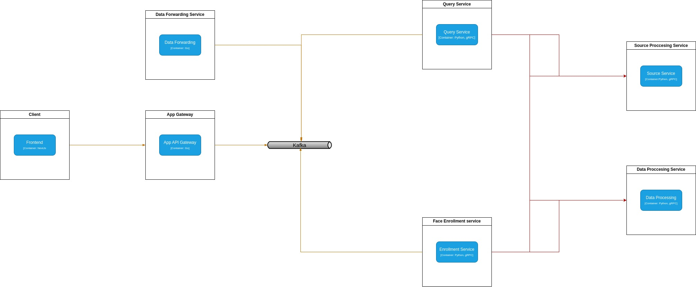
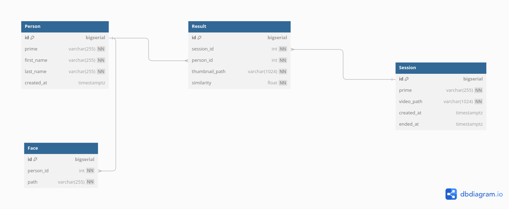

# Interview Task: Face Recognition System
## Software Architecture

This software system comprises a total of seven interconnected services, each contributing to our ultimate objective. These services are enumerated below, accompanied by brief introductions:
* **Client service**: Client frontend service which implemented by **NextJs**
* **App Gateway**: This service is responsible to provide some API for Client service to upload images/videos for puposes like enrollment and query. This service is totally implemented by **Golang** ( Go Fiber framework )
* **Data Forwardng Service**: This service read the broker result queue to log the results produced by query service. Also this service is written in **GoLang**
* **Query Service**: This service waits for an incomming query request which contains a video file then read the frames and uses Source and Data Processing services. This service is written by **Python**.
* **Face Enrollment service**: This service is responsible to get a message from queue which contains images for processing and storing.
* **Source Processing service (Detection service)**: This service is based on <u>gRPC</u> Which get frames and detect faces and their poses.
* **Data Processing service**: This service is also based on <u>gRPC</u> which is responsible to get face embeddings and store them in Vector database (**Annoy Index**)
  

## Data Model

This is the main data model which is used to store information and used in <u>App Gateway</u> and <u>Data forwarding services</u>.


## Deployment
### Requirements
* docker and docker compose plugin
* Nvidia GPU and driver
* nvidia docker container
### Clone the project
```bash
git clone 
```

### Download models
```bash
mkdir models
```
download the model weights, then extract and put it in project root

### Make directory and get access
```bash
mkdir -p storage/kafka storage/zookeeper
sudo chown 1001:1001 storage/kafka storage/zookeeper
```

### Run docker-compose
```
docker compose up
```
Note: ports like 3000, 8080, and 9093 will be used for services so they shouldn`t be busy.

### Capabilities
- [x] Enroll persons
- [x] Upload video
- [x] Show sessions
- [x] Show results
- [x] store embeddings in vector database
- [ ] Send one face instance per person with same track ID in incomming video

### Demo
You can download following [Link](URL "Optional Title") to see a brief demo.